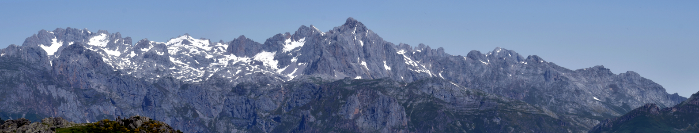

```{r setup, include=FALSE}
knitr::opts_chunk$set(echo = TRUE)
```



# The seed germination spectrum of alpine plants: a global meta-analysis

This repository stores all information related to the manuscript *The seed germination spectrum of alpine plants: a global meta-analysis*, including raw data, `R` scripts to process and analyse data, and `Rmarkdown` files to create the manuscript.

## Contents

This repository is organised following the advice of [Wilson et al. 2017](https://doi.org/10.1371/journal.pcbi.1005510) for recording and storing research projects.

The following materials are available in the folders of this repository:

* `data` Primary germination data and species traits.
* `doc` Files to create the manuscript using `Rmarkdown`.
* `results` Output of the `R` scripts, including MCMCglmm analysis outputs.
* `src` Scripts in `R` language used to process data and perform the analyses of the manuscript.

## Citation

Please cite this repository as `The seed germination spectrum of alpine plants: a global meta-analysis. Manuscript in preparation.`