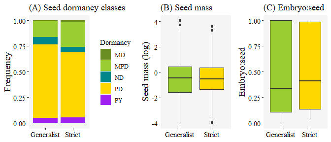
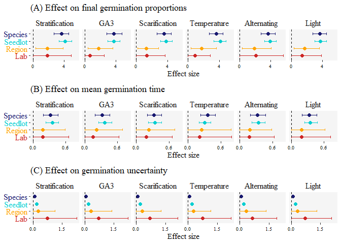
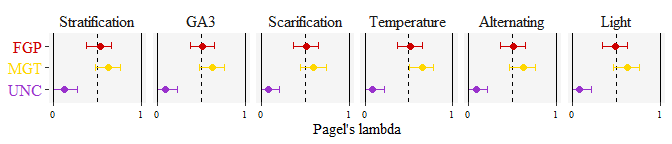

The seed germination spectrum of alpine plants: a global meta-analysis
================

Eduardo Fernández-Pascual1 +, Angelino
Carta2, Andrea Mondoni3, Lohengrin
Cavieres4, Sergey Rosbakh5, Susanna
Venn6, Annisa Satyanti7, Lydia Guja8,
Verónica F. Briceño7, Filip Vandelook10, Efisio
Mattana11, Arne Saatkamp12, Haiyan
Bu13, Karen Sommerville14, Peter
Poschlod5, Kun Liu13, Adrienne
Nicotra7, Borja Jiménez-Alfaro15

1 Departamento de Biología de Organismos y Sistemas,
Universidad de Oviedo, Oviedo/Uviéu, Spain; 2 Dipartimento di
Biologia, Botany Unit, University of Pisa, Pisa, Italy; 3
Department of Earth and Environmental Sciences, University of Pavia,
Pavia, Italy; 4 Departamento de Botánica, Facultad de
Ciencias Naturales y Oceanográficas, Universidad de Concepción,
Concepción, Chile; 5 Chair of Ecology and Conservation
Biology, Institute of Plant Sciences, University of Regensburg,
Regensburg, Germany; 6 Centre for Integrative Ecology, School
of Life and Environmental Sciences, Deakin University, Burwood,
Victoria, Australia; 7 Division of Ecology & Evolution,
Research School of Biology, The Australian National University,
Canberra, ACT, Australia; 8 Centre for Australian National
Biodiversity Research, CSIRO, Canberra, ACT, Australia; 9
National Seed Bank, Biodiversity Science Section, Australian National
Botanic Gardens, Canberra, ACT, Australia; 10 Meise Botanic
Garden, Meise, Belgium; 11 Natural Capital and Plant Health
Department, Royal Botanic Gardens, Kew, Ardingly, UK; 12 Aix
Marseille Université, Université d’Avignon, CNRS, IRD, IMBE, Marseille,
France; 13 State Key Laboratory of Grassland and
Agro-Ecosystems, Lanzhou University, Lanzhou, PR China; 14
The Australian Plant Bank, Royal Botanic Gardens and Domain Trust, Mount
Annan, NSW, Australia; 15 Research Unit of Biodiversity
(CSUC/UO/PA), University of Oviedo, Mieres, Spain

+ Correspondence: Departamento de Biología de Organismos y
Sistemas, Universidad de Oviedo, C/ Catedrático Rodrigo Uría, 33006
Oviedo/Uviéu, Spain. Email: <efernandezpascual@gmail.com>. Telephone:
+34985104787.

# Summary

  - Assumptions about the germination ecology of alpine plants are
    presently based on individual species and local studies. A current
    challenge is to synthesize, at the global level, the alpine seed
    ecological spectrum.
  - We performed a meta-analysis of primary data from laboratory
    experiments conducted across four continents (excluding the tropics)
    and 661 species, to estimate the influence of six environmental cues
    on germination proportion, mean germination time and germination
    synchrony; accounting for possible effects of seed morphology (mass,
    embryo:seed ratio) and phylogeny.
  - Most alpine plants show physiological seed dormancy, a strong need
    for cold stratification, warm-cued germination and positive
    germination responses to light and alternating temperatures. Species
    restricted to the alpine belt have a higher preference for warm
    temperatures and a stronger response to cold stratification than
    species whose distribution extends also below the treeline. Seed
    mass, embryo size and phylogeny have strong constraining effects on
    germination responses to the environment.
  - Globally, overwintering and warm-cued germination are key drivers of
    germination in alpine habitats. The interplay between germination
    physiology and seed morphological traits further reflects pressures
    to avoid frost or drought stress. Our results indicate the
    convergence, at the global level, of the seed germination spectrum
    of alpine species.

# Keywords

alpine; alternating temperature; cold stratification; embryo endosperm
ratio; light germination; seed dormancy; seed germination; seed mass

# Introduction

Alpine environments occur worldwide above the maximum elevation at which
trees can grow naturally (Körner & Paulsen, [2004](#ref-RN3024); Körner
*et al.*, [2011](#ref-RN3000); Testolin *et al.*, [2020](#ref-RN4750)).
These treeless habitats are characterized by low temperatures, unstable
substrates and short growing seasons (Körner, [2003](#ref-RN2392)).
Although most alpine plants can reproduce clonally (Körner,
[2003](#ref-RN2392)), sexual reproduction by diaspores (i.e. seeds,
fruits, or fruits with extra-ovarian structures attached; hereafter
‘seeds’) is the main strategy to maintain genetic diversity and to
colonize suitable new sites in response to environmental changes (Walck
*et al.*, [2011](#ref-RN3055)). However, the short reproductive season
of the alpine habitat constrains the phenological timing of flowering,
pollination, seed development and seed dispersal. For regeneration by
seed to be successful, dispersed propagules must germinate in the most
appropriate period to ensure the survival of seedlings (Chambers *et
al.*, [1990](#ref-RN4714); Schütz, [2002](#ref-RN2868); Forbis,
[2003](#ref-RN4717)). The physiological process of seed germination is
therefore an essential life stage that must be timed to occur when the
environment is favourable for subsequent seedling survival and growth
(Poschlod *et al.*, [2013](#ref-RN4691)). In alpine habitats, seed
germination will also be a crucial test for plant populations coping
with global change, determining whether they will persist or go into
extinction.

Natural selection is expected to favour seed germination requirements
that reduce the probability of facing environmental conditions which are
not appropriate for seedling survival and growth (Angevine & Chabot,
[1979](#ref-RN3375)). Thus, germination is chiefly regulated by
environmental cues related to water availability and soil temperature
(Bewley *et al.*, [2013](#ref-RN3368)). The propagules of many plant
species have also developed seed dormancy, by means of which germination
is prevented during periods that are only ephemerally favourable, like a
short warm spell in the middle of winter (Baskin & Baskin,
[2014](#ref-RN3214)). Different degrees of dormancy within a seed
population ensure the distribution of seedling emergence across time, a
form of bet-hedging offspring survival against unpredictable
environments (Venable, [2007](#ref-RN3065)). Other germination cues,
such as the response to diurnal alternating temperatures (Thompson,
[1977](#ref-RN1380)) and the need for light or darkness (Carta *et al.*,
[2017](#ref-RN4656)), allow for a fine-scale detection of germination
micro-niches and safe sites (Jumpponen *et al.*, [1999](#ref-RN4719)).
Given that current assumptions about the germination ecology of alpine
plants are mainly based on local studies, a current challenge is to
synthesize, at the global level, the seed ecological spectrum of alpine
plants. The seed ecological spectrum (Saatkamp *et al.*,
[2019](#ref-RN4655)) is defined as a set of seed traits that determines
the ability of plants to disperse, persist, germinate, and establish in
different habitats. A major goal for trait-based seed ecology is to
study the relationships and trade-offs between different aspects of the
seed ecological spectrum (Saatkamp *et al.*, [2019](#ref-RN4655)), such
as the physiological drivers of germination versus key morphological
traits like seed mass (Moles *et al.*, [2005](#ref-RN4916)) and the
embryo to seed ratio (Vandelook *et al.*, [2012](#ref-RN3685)).

Traditionally, alpine species have been described as having seeds with
physiological dormancy, i.e. a type of dormancy that is caused by the
seed’s internal balance of phytohormones and requires a long exposure to
dormancy-breaking treatments to be terminated (Schwienbacher *et al.*,
[2011](#ref-RN2943); Sommerville *et al.*, [2013](#ref-RN3703); Baskin &
Baskin, [2014](#ref-RN3214)). This physiological dormancy would prevent
precocious germination of recently dispersed seeds during autumn, when
appropriate conditions are not likely to persist for more than a few
weeks or days (Meyer & Monsen, [1991](#ref-RN3330)). A requirement for
cold stratification to break dormancy allows seeds to sense the snow
season, thereby postponing germination to a more favourable period for
seedling survival and development. Thus, it can be expected that a cold
stratification period is a requirement for seed germination in alpine
plants. One of the first experiments on this topic was conducted by
Söyrinki ([1938](#ref-RN4951)), who showed how the storage of
arctic-alpine species at winter temperatures (i.e. cold stratification)
increased seed germination in most species. Nonetheless, Amen
([1966](#ref-RN3213)) later suggested that cold stratification was not a
requirement for seed germination of alpine species from different
mountain ranges in the USA, a finding that was supported by subsequent
studies (Sayers, [1966](#ref-RN1484); Marchand & Roach,
[1980](#ref-RN2995); Kaye, [1997](#ref-RN4721)). More recently, research
on Australian alpine plants found that a cold stratification period only
increased germination in half of the species tested (Sommerville *et
al.*, [2013](#ref-RN3703); Hoyle *et al.*, [2015](#ref-RN3285)). Cold
stratification increased seed germination over a range of temperatures
in most of the species studied in the alpine zone of Japan (Shimono &
Kudo, [2005](#ref-RN707)). Along an elevational gradient in the central
Chilean Andes, cold stratification was an important requirement for seed
germination in species from lower elevations, while species from higher
sites did not germinate after a single period of cold stratification
(Cavieres & Sierra-Almeida, [2018](#ref-RN4713)). Finally, in a
comparative study on germination of unstratified seeds from different
habitats of the Austrian Alps, species from alpine grasslands had the
lowest final germination proportion, suggesting that they had the
highest level of dormancy (Margreiter *et al.*, [2020](#ref-RN4930)).

Seed dormancy is not the only trait that can prevent, in practice,
autumn germination. Early studies on the germination ecology of alpine
plants demonstrated that, in most species, recently dispersed seeds
require relatively high temperatures for germination (Söyrinki,
[1938](#ref-RN4951); Bliss, [1958](#ref-RN3258); Amen,
[1966](#ref-RN3213); Billings & Mooney, [1968](#ref-RN4712)). Warm-cued
germination has been considered as an adaptation to prevent seed
germination at the time of seed dispersal (autumn) when temperatures are
relatively low and there is a high risk of frost (Cavieres & Arroyo,
[2000](#ref-RN3393)). Indeed, germination of alpine seeds tends to occur
after winter, mainly in early summer (Körner, [2003](#ref-RN2392);
Mondoni *et al.*, [2015](#ref-RN2382)). In recent times, an increasing
number of studies reported that fresh seeds of some alpine plants can
also germinate at cool incubation temperatures or during cold
stratification treatments (Schwienbacher *et al.*, [2011](#ref-RN2943);
Hoyle *et al.*, [2015](#ref-RN3285); Fernández-Pascual *et al.*,
[2017](#ref-RN2371)[a](#ref-RN2371); Cavieres & Sierra-Almeida,
[2018](#ref-RN4713)). This cold-cued germination could be an adaptation
to germinate under snow or during snowmelt, which could presumably allow
seedlings to develop a deeper root system before topsoil desiccation in
summer (Kammer & Möhl, [2002](#ref-RN4720)), or to attain an optimal
size for overwintering (Billings & Mooney, [1968](#ref-RN4712)). Yet,
the generality of warm-cued germination across different alpine regions
and habitats has never been studied systematically, and the relative
importance of cold stratification versus warm-cued germination remains
unclear. A central question is whether physiological seed dormancy plays
a relevant role in postponing alpine germination during autumn and
winter, or whether the warm-cued germination is enough to prevent
germination under cool autumn temperatures. The response to this
question becomes pertinent under a warming climate, which could result
in non-dormant seeds germinating readily in autumn. Non-dormant seeds
could possibly have an advantage as the growing seasons become longer,
if seedlings have enough time to grow and become sufficiently large to
survive the winter snow season. Potentially, having a non-dormant or
less dormant seed could be a better strategy for alpine plants to thrive
under future climate (Verdú & Traveset, [2005](#ref-RN3317); Mondoni *et
al.*, [2015](#ref-RN2382)). However, we might also expect that seedlings
from these species will be exposed to frost damage if snow starts to
melt earlier and insulation during winter disappears (Venn *et al.*,
[2013](#ref-RN4944)) and therefore mechanisms that enable diverse
germination timing (i.e. low germination synchrony) may be favoured.

Besides patterns of seed dormancy and germination temperature, the
response of alpine seeds to diurnal alternating temperatures and light
can provide further information on their capacity to detect fine-scale
environmental cues. Fluctuations of diurnal temperature decrease with
increasing burial depths and the depth profile of this decrease depends
on soil type, vegetation cover and snow (Thompson, [1977](#ref-RN1380);
Van Assche & Vanlerberghe, [1989](#ref-RN4910); Saatkamp *et al.*,
[2011](#ref-RN4952)). Solar irradiance in physiologically significant
quantities penetrates only the first millimetres of the soil (Tester &
Morris, [1987](#ref-RN4909)). Therefore, the response to alternating
temperatures and light can indicate seeds whether they are buried deep
in the soil, in rock crevices or under snow. The depth of seed burial is
crucial for seedling emergence, as small seeds lack the resources to
survive until they reach the soil surface (Bond *et al.*,
[1999](#ref-RN4898)). A study of 445 species from the Qinghai-Tibet
plateau found that species from high elevation alpine meadows did not
show a significant response to diurnal temperature oscillations (Liu *et
al.*, [2013](#ref-RN3376)). This is intriguing given that alpine
habitats typically have a strong day-night climatic variation during the
growing season. Regarding light and darkness, some local studies have
found alpine species to have a preference for germinating in light
(Densmore, [1997](#ref-RN4730); Mondoni *et al.*, [2009](#ref-RN4729)).
This trait is linked with the creation of a persistent soil seed bank
(Venn & Morgan, [2010](#ref-RN4929); Jaganathan *et al.*,
[2015](#ref-RN4718)) which may be advantageous in the temporally and
spatially unpredictable alpine environments (Kalin Arroyo *et al.*,
[1999](#ref-RN4731); Cavieres & Arroyo, [2001](#ref-RN4732)). Indeed,
persistent alpine soil seed banks are more frequent than previously
supposed, as consistently reported in recent years (Venn & Morgan,
[2010](#ref-RN4929); Hoyle *et al.*, [2013](#ref-RN4945); Jaganathan *et
al.*, [2015](#ref-RN4718)). Nevertheless, other alpine species seem to
prefer germination in darkness (Schwienbacher *et al.*,
[2011](#ref-RN2943)), which may be interpreted as a strategy for
detecting safe sites in rock crevices (Arslan *et al.*,
[2011](#ref-RN3008)). Although some germination studies report
laboratory experiments conducted with constant and alternating
temperatures, or light and dark conditions, they are very much
case-dependent, and therefore it is difficult to evaluate whether these
factors show a consistent pattern across global alpine ecosystems.

In this work, we make a global collection of primary germination data
from laboratory experiments conducted with seeds of alpine plant species
from extratropical regions. The assembled dataset represents eight
seasonal alpine regions belonging to four continents. We perform a
meta-analysis of this dataset to investigate the germination response of
alpine plants to key environmental factors: dormancy-breaking treatments
(cold stratification, GA3 and scarification), average
germination temperature, diurnal alternating temperatures and light
(Bewley *et al.*, [2013](#ref-RN3368); Baskin & Baskin,
[2014](#ref-RN3214)). Given the heterogeneity of alpine species lineages
adapted to different regions, we account for the shared evolutionary
history using a phylogenetic comparative approach (Garamszegi,
[2014](#ref-RN3081)). We further analyse the relationships between
germination ecology and two morphological traits which are key drivers
of the seed ecological spectrum: seed mass and the embryo to seed ratio
(Saatkamp *et al.*, [2019](#ref-RN4655)). Our main aim in conducting
this work is to test the consistency of general assumptions about the
influence of major environmental cues on seed germination of alpine
plants. Specifically, we determine at the global scale whether alpine
seeds: (1) have physiological dormancy; (2) require cold stratification
to break dormancy; (3) need relatively warm temperatures to germinate;
(4) do not require alternating temperatures for germination; and (5)
respond positively to light. To understand the ecological constraints of
our meta-analysis on alpine species pools, we compare the germination
responses of strict alpine species (that occur exclusively above the
treeline) and generalist species (that occur above the treeline but also
at lower elevations). We can expect that the former group will show a
more convergent alpine germination syndrome, while the latter will be
more plastic in their response.

# Materials and Methods

## Data collection

We conducted a meta-analysis of primary data (Mengersen *et al.*,
[2013](#ref-RN4734)), which consists of pooling together original data
from different local studies to synthesize their conclusions at the
global level. All data processing, analysis and manuscript production
has been performed in *R* (R Core Team, [2020](#ref-RN2315)). The
original data, plus R code for the analysis and creation of the
manuscript using Rmarkdown, can be accessed at the GitHub repository
(see Data Availability Statement). To gather data, we contacted research
groups which have performed experiments on seed germination of alpine
plants, asking them to provide raw data from laboratory germination
experiments. The submitted data had to report the studied species, the
germination treatments, the number of seeds sown, and the number of
seeds germinated. We received data (Table 1) on species from the
Cantabrian Mountains of Spain, the European Alps, the Italian Apennines,
the Northern Caucasus, the Qinghai-Tibet Plateau of China, the Chilean
Andes, and the Australian Alps. We also received data on European alpine
species from *Enscobase*, the database of the European Native Seed
Conservation Network (<http://enscobase.maich.gr/index.tml>).

| Source                                                     | Coverage        | Records | Species | Strict |
| :--------------------------------------------------------- | :-------------- | ------: | ------: | -----: |
| Briceño, unpublished                                       | Andes           |     236 |      25 |      5 |
| Bu et al. (2007, 2008)                                     | Qinghai-Tibet   |    1766 |     242 |     68 |
| Cavieres & Arroyo (2000), Cavieres & Sierra-Almeida (2018) | Andes           |     804 |      31 |      6 |
| enscobase.maich.gr                                         | Europe          |     510 |     124 |     75 |
| Fernández-Pascual et al. (2017a)                           | Cantabrian Mts  |     792 |      22 |     14 |
| Liu et al. (2013)                                          | Qinghai-Tibet   |     465 |     151 |     42 |
| Mondoni, unpublished                                       | Apennines       |      32 |      10 |      7 |
| Mondoni et al. (2009), Mondoni et al. (2012)               | European Alps   |     506 |     101 |     74 |
| Rosbakh, unpublished                                       | Caucasus        |     263 |      18 |      9 |
| Rosbakh & Poschlod (2015)                                  | European Alps   |     971 |      21 |     15 |
| Satyanti, unpublished                                      | Australian Alps |     632 |      91 |     41 |
| Sommerville et al. (2013)                                  | Australian Alps |    1395 |      13 |      3 |
| Tudela-Isanta et al. (2018)                                | European Alps   |     376 |      47 |     29 |
| Venn (2007), Venn & Morgan (2009)                          | Australian Alps |    1051 |      15 |      5 |

**Table 1** *Description of the datasets contributing primary data to
this meta-analysis. The number of germination records, number of species
and number of strict alpine species are given.*

We standardized the species names according to *The Plant List* (The
Plant List, [2013](#ref-RN2321)) using the package *Taxonstand* (Cayuela
*et al.*, [2019](#ref-RN4660)) in *R*. For each species, we recorded its
elevation range from local floras (Hegi, [1906](#ref-RN4741); Pignatti,
[1982](#ref-RN4739); Castroviejo, [1987](#ref-RN3243); Brach & Song,
[2006](#ref-RN4742); Parolly & Rohwer, [2019](#ref-RN4740)), catalogues
(Rodríguez *et al.*, [2018](#ref-RN4738)) and herbaria (*Australian
National Herbarium*, <https://www.anbg.gov.au/cgi-bin/anhsir>). We used
the elevation ranges (i) to remove from the dataset outlier species that
do not grow above the treeline; and (ii) to classify the rest of the
species as *strict alpine* (i.e. species that only grow above the
treeline) or *generalist* (i.e. species that can grow above the treeline
but also in the lowlands). For each species, we compiled three
additional traits: seed dormancy class, seed mass and embryo:seed ratio.

We classified the species in seed dormancy classes following Baskin &
Baskin ([2014](#ref-RN3214)) and Rosbakh et
al. ([2020](#ref-RN4743)[a](#ref-RN4743)), using five categories:
physiological (germination prevented by the seed’s internal balance of
phytohormones), morphological (germination prevented by an embryo which
is underdeveloped at the time of dispersal), morphophysiological (both
physiological and morphological dormancy present), physical (germination
prevented by a water-impermeable seed coat) or non-dormant. We followed
the concept by Vleeshouwers et al. ([1995](#ref-RN3254)) to define
dormancy as an inner seed property (sometimes called ‘endodormancy’),
which should be differentiated from the absence of appropriate
germination cues in the environment (‘ecodormancy’); and the
classification system of Baskin and Baskin ([2004](#ref-RN3261)) based
on previous work by Nikolaeva et al. ([1985](#ref-RN2877)) who consider
morphological and physical dormancy as classes separated from
physiological dormancy.

We collected mean seed mass for each species as provided by the Royal
Botanic Gardens Kew Seed Information Database ([2017](#ref-RN2987)) and
additional sources (Bu *et al.*, [2007](#ref-RN4728),
[2008](#ref-RN4735); Liu *et al.*, [2013](#ref-RN3376)). We recorded the
embryo to seed surface area ratio for each species. Embryo to seed
surface area values were calculated by dividing embryo area by the
surface area of the seed, more specifically embryo plus endosperm and
perisperm. Measurements were made using the *ImageJ* software (Schneider
*et al.*, [2012](#ref-RN4708)) on drawings and photographs of seeds cut
in half along the longitudinal axis, retrieved mainly from Martin
([1946](#ref-RN3244)) and the Royal Botanic Gardens Kew Seed Information
Database ([2017](#ref-RN2987)), supplemented with own photographs
(Vandelook, unpublished). For some species that were missing seed mass
or embryo values, we calculated genus or family averages. In the case of
seed mass, we used species-level values for 473 species, and genus
averages for another 188 species. For embryo mass, we used 21
species-level values, 427 genus averages, and 213 family averages. The
collected species traits, including information on which taxonomic rank
was used to calculate the values for each species, is available in the
data folder of the GitHub repository (see Data Availability Statement).

## Germination response variables

We used the final germination proportion (i.e. the number of seeds
germinated out of seeds sown) at 8 weeks as the main response variable
for the germination treatments. Eight weeks was a compromise deadline to
unify datasets, as there was a small fraction of trials that had run for
longer times. We further calculated the mean germination time and the
germination uncertainty index with the package *GerminaR* (Lozano-Isla
*et al.*, [2019](#ref-RN4752)). Equations for these two germination
indices are available in Lozano-Isla et al. ([2019](#ref-RN4752)). Mean
germination time is the time that it takes for half of the seed lot to
germinate, indicating the germination speed in each experimental
condition. The germination uncertainty index estimates how scattered
germination is through time, giving an idea of whether germination is
synchronous (i.e. most seeds germinate around the mean germination time)
or asynchronous (i.e. germination events are separated through time
during the germination experiment). Lower values in the germination
uncertainty index indicate higher germination synchrony. The uncertainty
index is analogous to the synchrony index and we used it because, unlike
the latter, its values are not constrained between 0 and 1 (Lozano-Isla
*et al.*, [2019](#ref-RN4752)). To calculate these indices, we used only
records that met two conditions: (i) more than 50% final germination
percentage; and (ii) a mean germination time under 4 weeks. Within these
limits, we were able to calculate mean germination time and uncertainty
for 293 species. We established this conservative approach to prevent
the results being altered by a modification of the seed’s dormancy
status during the germination incubation (e.g. a fraction of the seed
lot is non-dormant at the beginning of the incubation and germinates
shortly after the start of the experiment; while another fraction is
originally dormant, loses dormancy in response to the incubation
conditions, and germinates in a second wave). The primary germination
dataset is available in the data folder of the GitHub repository (see
Data Availability Statement).

## Statistical analyses

We meta-analysed germination data by fitting generalized mixed models
with Bayesian estimation (Markov Chain Monte Carlo generalized linear
mixed models, MCMCglmms) using the R package *MCMCglmm* (Hadfield,
[2010](#ref-RN4755)). To model final germination proportion, we used
binomial MCMCglmms, while for mean germination time and the germination
uncertainty index we used gaussian MCMCglmms. Models had, as fixed
effects, the experimental conditions (stratification, GA3,
scarification, temperature, alternating temperature and light), plus
their interaction with seed mass and embryo:seed, and the strict alpine
or generalist character of the species. Random effects included a
reconstructed phylogenetic tree for the 661 species, and species
identity, seed lot, lab (i.e. data provider), and alpine region (Table
1). To create the phylogeny, we used the R package *V.PhyloMaker* (Jin &
Qian, [2019](#ref-RN4753)) which contains an updated mega-tree of the
seed plants based on Smith & Brown ([2018](#ref-RN4754)). We placed taxa
absent from the mega-tree at the genus-level basal node. The
phylogenetic tree is available in the data folder of the GitHub
repository (see Data Availability Statement). In all models, all
variables were scaled so their contribution to the effect sizes could be
compared. We used weakly informative priors in all models, with
parameter-expanded priors for the random effects. Each model was run for
500,000 MCMC steps, with an initial burn-in phase of 50,000 and a
thinning interval of 50 (De Villemereuil & Nakagawa,
[2014](#ref-RN4756)), resulting, on average, in 9,000 posterior
distributions. From the resulting posterior distributions, we calculated
mean parameter estimates and 95% Highest Posterior Density (HPD) and
Credible Intervals (CI). We estimated the significance of model
parameters by examining CIs, considering parameters with CIs overlapping
with zero as non-significant. To estimate the phylogenetic signal of
seed germination over all variables, we used Pagels’s lambda (λ) (Pagel,
[1999](#ref-RN4757)), estimated simultaneously with the models by
calculating the mean of the posterior distribution and the 95% CI of λ
as indicated by De Villemereuil et al. ([2014](#ref-RN4756)). When λ =
0, related taxa are no more similar than expected by chance, while when
λ = 1, the trait is evolving following a constant variance random walk
or Brownian motion model; intermediate values of λ indicate a
phylogenetic correlation in trait evolution that does not fully follow a
Brownian motion model (Pagel, [1999](#ref-RN4757)). Detailed results of
the MCMCglmms are available in the results folder of the GitHub
repository (see Data Availability Statement).

## Visualization of the alpine seed germination spectrum

To visualize the seed germination spectrum of alpine plants, we employed
a Factorial Analysis of Mixed Data (FAMD) as implemented in the package
*FactoMineR* (Le *et al.*, [2008](#ref-RN3166)). FAMD ordination
combines the properties of PCA and MCA to jointly measure the variation
of continuous and categorical variables. The ordination was performed at
the species level, i.e. calculating a series of continuous and
categorical traits for each species. We transformed the final
germination proportions to create a continuous variable for each
germination cue (i.e. stratification, GA3, scarification,
temperature, alternating temperatures and light). To do so, for each cue
and species, we calculated a weighted average of the cue levels (in the
case of temperature, cue levels were the temperature treatments; for the
other cues the levels were 0 = absence and 1 = presence), weighting by
the germination proportion at each level. This approach underrepresents
the importance of the levels that were not tested for a given species,
but can serve as a proxy of the response to the germination cues when
visualized across the whole dataset; it must be stressed that this stage
of the analysis serves only for visualization and not for hypothesis
testing. We also included germination timing traits by calculating
single values for the mean germination time (the minimum, i.e. the time
taken at the most favourable treatment) and the germination uncertainty
index (the mean). We conducted the FAMD with the 293 species for which
we had mean germination time and germination uncertainty index values.
We finally included the continuous variables seed mass and embryo:seed,
as well as the categorical variables dormancy class (physiological,
morphophysiological, morphological, physical or non-dormant) and
distribution (strict alpine vs. generalist species).

# Results

## Description of the dataset

The final dataset used in our meta-analysis contained 9,799 records
(i.e. germination proportions for a given seed lot of a species,
recorded in a set of experimental conditions) contributed by 12 research
groups, representing 62 seed plant families and 661 species. From these,
291 were categorized as strict alpine species and 370 as generalist.
Seed lots were originally sampled in 8 alpine regions of the world
(Table 1), at middle latitudes of both hemispheres.

Most species in the dataset were reported as having dormant seeds
(**Fig. 1a**), but the frequency of the dormancy classes did not differ
between generalist and strict alpine species. Among those species with
dormant seeds, physiological dormancy was the most common dormancy
class, followed by morphophysiological and then physical. Both strict
alpine and generalist species had a similar range of values for seed
mass (**Fig. 1b**) and embryo:seed ratio (**Fig. 1c**). The values of
seed mass ranged from 0.02 mg (*Calceolaria purpurea*) to 58 mg (*Vicia
orobus*), with a median value of 0.56 mg. Embryo:seed ratio encompassed
the full range of potential values, from endospermic species with very
small embryos (0.001) to non-endospermic seeds that store nutrients in
the cotyledons (1). The median value was 0.34.

**Figure 1** *Seed dormancy classes, seed mass and embryo to seed ratio
in the subsets of strict alpine and generalist species analysed in this
study. Strict species are restricted to the alpine belt, generalist
species can be found in the alpine belt but also below the treeline.
Seed dormancy classes are abbreviated as follows: MD (morphological),
MPD (morphophysiological), ND (non-dormant), PD (physiological), PY
(physical).*

The total number of seeds used in the experiments was 365,808.
Germination temperatures (i.e. the weighted average of the day and night
temperatures, weighted by the duration of each phase) ranged from 0 to
36 ºC, with 7,521 records of constant temperatures (i.e. experiments
that used the same temperature during all their duration) and 2,278 of
alternating temperatures (i.e. experiments where different temperatures
were applied during the day and the night, in diurnal cycles). Seeds
were exposed to light during some part of the diurnal cycle in 8,933
records and kept in total darkness in 866 records. The experiments were
performed with untreated seeds in 7,297 records, and of the rest, the
majority (2,436) went through cold stratification (\< 5 ºC, in
darkness). Scarification (i.e. an abrasion of the seed coat to allow
water imbibition) was performed in 119 records, and GA3 (a
plant hormone that promotes embryo growth and stimulates germination) in
651 records.

## Dormancy breaking treatments

In general, stratification significantly increased the final germination
proportion (**Fig. 2a**), as shown by a credible interval not
overlapping zero. This positive effect occurred in both generalist and
strict alpine species, although the effect size was larger in the strict
alpine group. Stratification slightly reduced the mean germination time
(**Fig. 2b**), which was evident in the generalist species, but not in
the strict alpine species. Further, stratification reduced the
germination uncertainty index as a general response (**Fig. 2c**), and
slightly more so in generalist species. Seed mass did not interact with
stratification, but species with larger embryos had a smaller response
to stratification in their final germination proportion and reduced less
markedly their mean germination time and germination uncertainty index.
GA3 had similar effects to stratification, with the main
difference being that seed mass affected the response to GA3,
whereas it did not interact with the response to stratification.

Scarification promoted the germination proportion (**Fig. 2a**) and
reduced the mean germination time (**Fig. 2b**), but it did not affect
the germination uncertainty index (**Fig. 2c**). Strict alpine species
were slightly more responsive to scarification than generalist species.
Heavier seeds were more responsive to scarification, while seeds with
larger embryos responded less.

**Figure 2** *Effect of the germination environment on germination,
according to the MCMC meta-analysis of primary data. The dots indicate
the posterior mean of the effect size, and the brackets its 95 %
credible interval. The line of zero effect is shown. When the credible
intervals overlap with the zero-effect line, the effect is not
significant. Some effects that overlapped with zero (i.e. had no effect)
and whose credible intervals were excessively wide are not shown for
clarity’s sake. The figure shows first the main effect, then the effects
for the strict alpine and generalist groups, and then the interaction
with seed mass and embryo:seed. A negative interaction (e.g. seed mass
and light, in the case of the germination proportion) indicates that, as
the interacting factor increases (e.g. seed mass) the response to the
germination cue (e.g. light) decreases, in comparison with the main
effect.*

## Germination temperature

Temperature had a positive significant effect on the final germination
proportion (**Fig. 2a**), indicating a preference for warmer
temperatures. Warmer temperatures also significantly decreased mean
germination time (**Fig. 2b**) and the germination uncertainty index
(**Fig. 2c**). The effect of warmer temperatures was slightly higher in
strict alpine than in generalist species, although the credible
intervals of the two groups of species do overlap. Seed mass and
embryo:seed had a negative interaction with temperature, reducing the
response to temperature. In other words, heavier and less endospermic
seeds had a smaller increase in germination proportion and a smaller
decrease in mean germination time when germinating in warmer
temperatures. The germination uncertainty index did not show an
interaction with seed mass or embryo:seed.

## Alternating temperatures

Alternating temperatures had a positive effect on the final germination
proportion (**Fig. 2a**), but not on the mean germination time (**Fig.
2b**) or the germination uncertainty index (**Fig. 2c**). The positive
effect on the germination proportion was slightly higher in the
generalist species. As in the case of the mean germination temperature,
higher seed mass and embryo:seed values reduced the positive effect of
alternating temperatures on the final germination proportion.
Alternating temperatures resulted in faster germination (reduced the
mean germination time) for seeds with low values of embryo:seed.

## Light

Light increased the final germination proportion (**Fig. 2a**), with no
differences between strict alpine and generalist species. It did not
affect the mean germination time (**Fig. 2b**), but it did result in
more variable germination (increased the germination uncertainty index)
of generalist species (**Fig. 2c**). Heavier and less endospermic seeds
responded less to light.

## Random effects and phylogenetic signal

Random factors had a significant effect in the MCMCglmm models (**Fig.
3**). The final germination proportion and the mean germination time
were affected more strongly, on average, by the seed lot and the species
identity, suggesting that these traits are subject to intra- and
interspecific variability, respectively. Alpine region and lab had a
lower average effect and more variability as shown by their credible
intervals. The germination uncertainty index showed the opposite
pattern, with a stronger effect of lab and alpine region. The
phylogenetic signal in the response to all germination parameters
(**Fig. 4**) was significantly positive for the final germination
proportion and the mean germination time. For the germination
uncertainty index, it overlapped with zero, indicating a weak effect of
phylogeny. The results for the germination uncertainty index indicate
that it might have been more sensitive to the frequency of germination
scoring, which was different in different labs. Detailed values of
phylogenetic signal for all model interactions are available in the
results folder of the GitHub repository (see Data Availability
Statement).

**Figure 3** *Effect of the random factors on germination, according to
the MCMC meta-analysis of primary data. The dots indicate the posterior
mean of the effect size, and the brackets its 95 % credible interval.
The line of zero effect is shown.*

**Figure 4** *Phylogenetic signal in the response to the germination
environment. When lambda = 0, related taxa are no more similar than
expected by chance; when lambda = 1, the trait is evolving following a
constant variance random walk or Brownian motion model. FGP = final
germination proportion. MGT = mean germination time. UNC = germination
uncertainty index.*

## FAMD ordination

The first FAMD axis explained 17% of the variation (**Fig. 5**). The
quantitative variables with the largest contribution to this first axis
were germination temperature, germination uncertainty, GA3
and alternating temperatures. Among the qualitative factors, the strict
alpine / generalist categories contributed to axis 1. In summary, the
horizontal axis separated (i, left) generalist species with a positive
response to alternating temperatures and more germination uncertainty
from (ii, right) strict alpine species with a preference for warmer
temperatures and a positive response to GA3. Axis 2 explained
12% of the variability. The main contributing variables were
embryo:seed, mean germination time, seed mass and scarification; and the
main categorical factors were physical dormancy and morphophysiological
dormancy. This axis separated (iii, bottom) morphophysiologically
dormant species with longer mean time to germination from (iv, top)
physically dormant species that responded to scarification and had
heavier, less endospermic seeds.

**Figure 5** *FAMD ordination of the alpine seed germination spectrum.
Each square is a species. Labels indicate the contribution of the
variables to the axes. Panels A and B correspond to quantitative traits;
panel C and D to qualitative traits. MGT = mean germination time. UNC =
germination uncertainty index. Seed dormancy classes are abbreviated as
follows: MD (morphological), MPD (morphophysiological), ND
(non-dormant), PD (physiological), PY (physical). Strict species are
restricted to the alpine belt, generalist species can be found in the
alpine belt but also below the treeline.*

# Discussion

Our meta-analysis of primary germination data shows that alpine seeds
tend to germinate when, after weeks of exposure to conditions that mimic
winter, they experience mid-summer temperatures. The germination ecology
of strict alpine species is characterized by (1) physiological seed
dormancy; (2) a strong need for cold stratification or GA3 to
break dormancy; (3) warm-cued germination; (4) a positive response to
alternating temperatures, although not so prominent as in generalist
species; (5) a positive response to light; (6) slow and relatively
synchronous germination; and (7) an interplay with seed and embryo size,
with smaller and more endospermic seeds being more responsive to
stratification, warmth, alternating temperatures and light. Here we
discuss the ecological significance of these responses and how they
define the seed germination spectrum of alpine plants.

## Seed dormancy

Our dataset shows that seed dormancy is frequent across alpine species
and plays an important role in postponing plant recruitment to
favourable times. The frequency of dormancy classes displayed by strict
alpine and generalist species is similar, suggesting that this is a
general trait of cold-adapted mountain species. Seeds with the two most
frequent dormancy classes, i.e. physiological and morphophysiological,
require a stratification period during which certain conditions
(e.g. cold and wet, although other combinations are possible) are met
over a period of months (Baskin & Baskin, [2014](#ref-RN3214); Rosbakh
*et al.*, [2020](#ref-RN4743)[a](#ref-RN4743)). Indeed, our results show
that cold stratification consistently promotes germination, while the
phytohormone gibberellic acid (GA3) works as a substitute of
cold stratification to overcome physiological dormancy. Additionally, we
found some species with physical dormancy. This dormancy type can be
broken by mechanical scarification via freezing-thawing cycles in spring
or extreme temperature fluctuations during summer, but it is also
capable of responding to seasonal cycles of temperature and humidity
(Van Assche *et al.*, [2003](#ref-RN780)).

Together, these results confirm that overwintering is essential for
promoting seed germination in alpine species, concurring with previous
local studies (Cavieres & Arroyo, [2000](#ref-RN3393); Schütz,
[2002](#ref-RN2868); Giménez-Benavides *et al.*, [2005](#ref-RN698);
Shimono & Kudo, [2005](#ref-RN707); Sommerville *et al.*,
[2013](#ref-RN3703); García-Fernández *et al.*, [2015](#ref-RN2355);
Hoyle *et al.*, [2015](#ref-RN3285); Fernández-Pascual *et al.*,
[2017](#ref-RN2371)[a](#ref-RN2371); Cavieres & Sierra-Almeida,
[2018](#ref-RN4713)). Since global climate change is causing major
changes in snow cover duration (Beniston, [2012](#ref-RN4917); Gobiet
*et al.*, [2014](#ref-RN4918)), it could disrupt natural cold
stratification cycles in alpine environments, compromising population
viability and indirectly favouring species with no stratification
requirement (Sommerville *et al.*, [2013](#ref-RN3703)). This risk will
be partly alleviated by the plasticity of physiological seed dormancy in
response to the seed maturation temperature (Fernández-Pascual *et al.*,
[2013](#ref-RN2358); Carta *et al.*,
[2016](#ref-RN2899)[b](#ref-RN2899)). ‘Seed memory’ via maternal effects
facilitates acclimatisation to changing environments, and can reduce the
stratification requirements of seeds produced in a warmer climate
(Fernández-Pascual *et al.*, [2019](#ref-RN2249)).

## Thermal regulation of germination

We found a general increase of seed germination with higher incubation
temperatures. This effect was more pronounced in strict alpine compared
to generalist species, confirming previous local studies (Walder &
Erschbamer, [2015](#ref-RN3266); Fernández-Pascual *et al.*,
[2017](#ref-RN2371)[a](#ref-RN2371)). It was also more pronounced in
small seeded and endospermic species. Small-seeded species have a lower
proportion of seedling survival under drought (Leishman & Westoby,
[1994](#ref-RN4530)) but may require warmer germination temperatures
than large-seeded species, especially in seasonal climates (Arène *et
al.*, [2017](#ref-RN2399)). Considering that risk reduction is an
important selective pressure for the evolution of germination traits
(Venable & Brown, [1988](#ref-RN4915)), a plausible explanation for
these patterns is that alpine plants received selection pressure from
damaging spring frosts and evolved a frost avoidance mechanism by
germinating at high temperatures (Taschler & Neuner,
[2004](#ref-RN4908); Marcante *et al.*, [2012](#ref-RN4722); Rosbakh *et
al.*, [2020](#ref-RN4906)[b](#ref-RN4906)). Moreover, strict alpine
species may be less subjected to drought damage during establishment
compared to generalist species: as elevation increases, plants face less
drought risk because precipitation increases (except in Mediterranean
and semi-arid mountains), but at the same time there is a higher
probability of early or late season frosts (Körner, [2003](#ref-RN2392);
Schrier *et al.*, [2007](#ref-RN4914); Beniston, [2016](#ref-RN4897)).
Together, these results indicate that germination patterns in alpine
species are driven by an interplay of seed size and germination
temperature to escape either frost or drought stress: small seeds are
being selected for fast germination at warm temperatures, in order to
escape unfavourable early-spring frost; while large seeds are being
selected for slower germination under cooler conditions, which should
maximize emergence during snowmelt (when water availability is highest)
giving seedlings adequate time to develop a root system to cope with
desiccation risks in summer. Supporting this view, seedlings of alpine
pioneer species have a low frost resistance (Marcante *et al.*,
[2012](#ref-RN4722)), yet tolerate heat up to 40–50°C (Marcante *et
al.*, [2014](#ref-RN4902)).

In our analysis, increasing temperatures also decreased germination
uncertainty, showing that germination synchrony is a plastic trait
driven by temperature. While asynchronous germination is thought to be a
form of adaptation to unpredictable environments (Wagner & Simons,
[2009](#ref-RN3690); Simons, [2011](#ref-RN3734)), our results indicate
that asynchronous germination occurs when temperatures are relatively
cool, likely as a bet-hedging strategy against the risk of early-spring
frost. On the other hand, a fast and synchronised germination at warm
conditions (i.e. in late spring) may be another important strategy that
increases alpine seedling survival by avoiding drier conditions in
summer. The extreme germination uncertainty syndrome, i.e. staggering
germination so that emergence occurs both before and after winter, is
known in alpine species (Körner, [2003](#ref-RN2392); Hoyle *et al.*,
[2015](#ref-RN3285); Satyanti *et al.*, [2019](#ref-RN4907)). If autumn
seedlings grow faster than spring seedlings (Satyanti *et al.*,
[2019](#ref-RN4907)), this will likely have cascading effects on
individual fitness along the life of the plant (Donohue *et al.*,
[2005](#ref-RN3036), [2010](#ref-RN2384)).

## Alternating temperatures and light

We also found a positive germination response to alternating
temperatures and light, conditions that mimic the environment in the
upper soil and certain microsites during the snow-free season (Billings
& Mooney, [1968](#ref-RN4712); Körner, [2003](#ref-RN2392); Mondoni *et
al.*, [2012](#ref-RN3029)). Alternating temperatures had a slightly
lower effect on strict alpine species, compared with generalist species,
but still had some effect. This partly contradicts the findings of Liu
et al. ([2013](#ref-RN3376)), who found no response to temperature
fluctuations for species distributed only at high elevations of the
Qinghai-Tibet Plateau. Liu and co-workers argued that, in that area,
high temperature fluctuations may occur throughout the year, and
therefore fluctuating temperature alone may not be a reliable indicator
of suitable conditions for seedling establishment and growth (Liu *et
al.*, [2013](#ref-RN3376)). When analysed at the global level,
alternating temperatures generally increase germination of alpine seeds,
which corresponds well with the fact that most alpine regions have a
strong day-night climatic variation during the growing season. It is
also not surprising that we detected a negative interaction between seed
mass and the germination response to light and alternating temperature
regimes, since large seeds can afford to germinate at greater depths
(where they are more protected from the alpine environment) and still
reach the soil surface (Bond *et al.*, [1999](#ref-RN4898); Pons,
[2000](#ref-RN4904)).

## The alpine seed germination spectrum

Using the whole set of traits compiled in this study we can visualize
the seed germination spectrum of alpine plants. At one end of the
spectrum, strict alpine species tend to germinate slowly and
synchronously, require warm temperatures and light to germinate, and
need stratification or GA3 to break physiological dormancy.
At the other end, generalist species tend to germinate fast, show a
bet-hedging strategy (i.e. high germination uncertainty) and germination
traits that suggest fast germination after specific cues
(e.g. scarification or alternating temperatures). The dormancy classes
without a physiological component (non-dormant, physical, and
morphological) appear associated with generalist species. This gradient
of regenerative strategies mirrors prominent gradients of fast or slow
population dynamics (Silvertown *et al.*, [1992](#ref-RN4922); Nobis &
Schweingruber, [2013](#ref-RN4921)), fast or slow developing leaf traits
(Wright *et al.*, [2004](#ref-RN4923)), or large sets of plant
ecological features (Grime, [1977](#ref-RN2279)). ‘Fast’ regeneration
can be understood as a plastic and opportunistic strategy to cope with
frequently disturbed habitats such as avalanche ways, steep eroding
slopes, regressing glaciers, and riverbeds (Pierce *et al.*,
[2007](#ref-RN4926); Gentili *et al.*, [2013](#ref-RN4925)). The ‘slow’
regeneration of strict alpine species, on the other hand, seems to be a
more specialized syndrome and might be the result of convergent
evolution acting on those species that are truly restricted to the
alpine vegetation belt.

A general assumption of seed trait ecology is that seed mass and
embryo:seed ratios are relatively conserved across related species
(Moles *et al.*, [2005](#ref-RN4916); Vandelook *et al.*,
[2012](#ref-RN3685)). In our alpine dataset, both traits show no
differences between strict alpine and generalist species. This is in
line with the ambiguity of relationships between seed mass and elevation
that have been found for alpine species, including examples of negative
(Wang *et al.*, [2014](#ref-RN4912)), positive (Pluess *et al.*,
[2005](#ref-RN4903)) or absent (Vandelook *et al.*, [2012](#ref-RN3685);
Bauk *et al.*, [2015](#ref-RN4896)) correlations. The similarity in
embryo:seed ratio between generalist and strict alpine species also
confirms the lack of correlation between embryo-seed ratio and elevation
found in the Apiaceae (Vandelook *et al.*, [2012](#ref-RN3685)). In
contrast with the supposed phylogenetic conservatism of these
morphological traits, physiological germination responses are understood
to be more plastic traits that can quickly respond to new situations
(Fernández-Pascual *et al.*, [2019](#ref-RN2249)). While phylogenetic
signal in seed germination is generally found, especially in highly
selective environments (Carta *et al.*,
[2016](#ref-RN3001)[a](#ref-RN3001); Arène *et al.*,
[2017](#ref-RN2399); Fernández-Pascual *et al.*,
[2017](#ref-RN2865)[b](#ref-RN2865)), germination patterns can also be
shared between phylogenetically distant species (Vandelook *et al.*,
[2019](#ref-RN4911)) and have low or absent phylogenetic signal (Rosbakh
& Poschlod, [2015](#ref-RN2365); Fang *et al.*, [2017](#ref-RN4900);
Fernández-Pascual *et al.*, [2017](#ref-RN2371)[a](#ref-RN2371)). The
phylogenetic signal in germination responses that we found here
indicates that evolutionary history cannot be neglected when studying
seed germination patterns. Furthermore, we detected that seed-embryo
size influences germination responses to environmental cues, with
smaller and more endospermic seeds being more responsive to warmth,
light and alternating temperatures. Previous studies have shown that
non-endospermic seeds are smaller and are likely to be non-dormant at
the time of dispersal and thus germinate quicker than alpine endospermic
seeds (Sommerville *et al.*, [2013](#ref-RN3703); Hoyle *et al.*,
[2015](#ref-RN3285); Satyanti *et al.*, [2019](#ref-RN4907)). Together,
these results indicate that seed morphology and physiology are connected
and may be subjected to co-adaptation. This connection, intertwined with
their shared phylogenetic history, may constrict the potential
variability of the seed ecological spectrum.

## Future directions

Our first global assessment of the seed germination spectrum in relation
with seed morphology supports the existence of trade-offs between sets
of regenerative traits (Saatkamp *et al.*, [2019](#ref-RN4655)), such as
the relationship we found between seed/embryo size, germination speed
and germination responses to temperature and light. Future studies will
need to consider, as we did, evolutionary history and seed morphology as
intrinsic constraints of the seed ecological spectrum; while the seed
germination spectrum we described here will need to be explored at the
community level (Jiménez-Alfaro *et al.*, [2016](#ref-RN2352)).

This study also highlights the general lack of seed germination studies
on tropical alpine species. Although there is an increasing interest in
the ecology of plants from tropical alpine regions, we could not find
seed germination data to include in our meta-analysis. Compared with
temperate alpine ecosystems, tropical alpine environments are relatively
aseasonal and most plants have been reported as flowering throughout the
year (Gehrke, [2018](#ref-RN4957)). Rather than being exposed to snow in
winter and high temperatures in summer, tropical alpine plants face a
year-round stress from night-time frost (Körner, [2003](#ref-RN2392)).
These different selective pressures suggest that the cold-adapted
germination syndrome of temperate alpine seeds may not be prevalent in
the tropical alpine flora. That means that our study is valid for
temperate alpine regions, where alpine habitats mainly occur (Testolin
*et al.*, [2020](#ref-RN4750)), but not necessarily for tropical alpine
systems. We thus recommend to focus future research on the seed ecology
of high-mountain tropical areas.

Another aspect that calls for future efforts is a finer study of
germination cues. To produce this meta-analysis, we had to assume some
simplifications in order to merge disparate datasets: we considered
coarse cues that are routinely recorded in germination tests, like the
presence/absence of light, alternating temperatures or cold
stratification. New research should aim to decompose these binary cues
into finer quantitative variables which provide a more precise
environmental signalling, such as the red:far red ratio
(Jankowska-Blaszczuk & Daws, [2007](#ref-RN604)), the length of the
photoperiod (Black & Wareing, [1954](#ref-RN1883)), the amplitude of the
diurnal thermal oscillations (Fernández-Pascual *et al.*,
[2015](#ref-RN2387)) or the length and temperature of cold
stratification (Pritchard *et al.*, [1996](#ref-RN2346)). In addition,
new field research is necessary to assess germination phenology in
response to temperature and water availability on the upper soil layer.

## Conclusions

This study demonstrates how alpine plants from different regions of the
world respond similarly to germination cues that support successful
regeneration: cold stratification, warm and alternating temperatures,
and light. These cues, particularly cold stratification and warm
temperatures, are generally associated with cold-adapted herbaceous
species in a broad sense (Fenner & Thompson, [2005](#ref-RN3397); Baskin
& Baskin, [2014](#ref-RN3214); Rosbakh & Poschlod, [2015](#ref-RN2365)).
Nonetheless, our results show that the response to stratification and
temperature is more prominent in strict alpine species when comparing
them with generalist plants that can grow opportunistically in the
alpine belt. This suggests an evolutionary convergence of germination
patterns in those species truly adapted to alpine ecosystems. We can
conclude that, while alpine plants do not show a unique germination
syndrome, they do show a more extreme or specialized version of the
cold-adapted temperate germination syndrome.

# Acknowledgements

EFP received financial support from the Government of Asturias and the
FP7 – Marie Curie - COFUND programme of the European Commission (Grant
‘Clarín’ ACB17-19). BJA and EFP were funded by the Spanish Research
Agency (PID2019-108636GA/ AEI/ 10.13039/501100011033). EM was supported
by the Future Leaders Fellowship - Diversity and Livelihoods, of the
Royal Botanic Gardens, Kew. Authors thank Amelia Martyn Yenson for help
in experimental work. This research was supported by NGSeeds, the Next
Generation Seed Ecology, Evolution and Data Science virtual working
group.

# Author Contribution

BJA conceived the original idea. EFP, AC, AM, LC, SR, SV, AnS, LG, VB,
FV, HB, KS, PP, KL, AN contributed data. EFP assembled and managed the
database. AC and EFP analysed data. EFP led manuscript writing, with
contributions from BJA, AC, AM, LC, SR, SV, AnS, LG, VB, FV, EM, ArS.
All authors revised the manuscript and approved the final version.

# Data Availability Statement

The original data, R code for the analysis and creation of the
manuscript can be accessed at the GitHub repository
<https://github.com/efernandezpascual/alpineseeds>. A version of record
of the repository can be found at
<https://doi.org/10.5281/zenodo.4270344>.

# References

**Amen RD**. **1966**. The extent and
role of seed dormancy in alpine plants. *Quarterly Review of Biology*
**41**: 271–281.

**Angevine MW,
Chabot BF**. **1979**. Seed
germination syndromes in higher plants. In: Solbrig OT, Jain S, Johnson
GB, Raven PH, eds. Topics in Plant Population Biology. New York:
Columbia University Press, 188–206.

**Arène F,
Affre L,
Doxa A,
Saatkamp A**. **2017**. Temperature
but not moisture response of germination shows phylogenetic constraints
while both interact with seed mass and lifespan. *Seed Science Research*
**27**: 110–120.

**Arslan H,
Kirmizi S,
Güleryüz G,
Sakar F**. **2011**. Germination
requirements of *Androsace villosa* L. (Primulaceae). *Acta Biologica
Cracoviensia Series Botanica* **53**: 32–36.

**Baskin JM,
Baskin CC**. **2004**. A
classification system for seed dormancy. *Seed Science Research* **14**:
1–16.

**Baskin CC,
Baskin JM**. **2014**. *Seeds.
Ecology, Biogeography and Evolution of Dormancy and Germination. Second
Edition*. San Diego: Academic Press.

**Bauk K,
Pérez-Sánchez R,
Zeballos SR,
Las Peñas ML,
Flores J,
Gurvich DE**. **2015**. Are seed mass
and seedling size and shape related to altitude? Evidence in
*Gymnocalycium monvillei* (Cactaceae). *Botany* **93**: 529–533.

**Beniston M**. **2012**. Is snow in
the Alps receding or disappearing? *WIREs Climate Change* **3**:
349–358.

**Beniston M**. **2016**.
*Environmental Change in Mountains and Uplands*. Routledge.

**Bewley JD,
Bradford K,
Hilhorst H,
Nonogaki H**. **2013**. *Seeds:
Physiology of Development, Germination and Dormancy. 3rd Edition*.
Berlin - Heidelberg - New York: Springer.

**Billings WD,
Mooney HA**. **1968**. The ecology of
arctic and alpine plants. *Biological Reviews* **43**: 481–529.

**Black M,
Wareing P**. **1954**. Photoperiodic
control of germination in seed of birch (*Betula pubescens* Ehrh.).
*Nature* **174**: 705–706.

**Bliss LC**. **1958**. Seed
germination in arctic and alpine species. *Arctic* **11**: 180–188.

**Bond WJ,
Honig M,
Maze KE**. **1999**. Seed size and
seedling emergence: an allometric relationship and some ecological
implications. *Oecologia* **120**: 132–136.

**Brach AR,
Song H**. **2006**. eFloras: new
directions for online floras exemplified by the Flora of China project.
*Taxon* **55**: 188–192.

**Bu H,
Chen X,
Xu X, Liu
K, Jia P,
Du G**. **2007**. Seed mass and
germination in an alpine meadow on the eastern Tsinghai–Tibet plateau.
*Plant Ecology* **191**: 127–149.

**Bu H,
Du G,
Chen X,
Xu X, Liu
K, Wen S**. **2008**.
Community-wide germination strategies in an alpine meadow on the eastern
Qinghai-Tibet plateau: phylogenetic and life-history correlates. *Plant
Ecology* **195**: 87–98.

**Carta A,
Hanson S,
Müller JV**. **2016a**. Plant
regeneration from seeds responds to phylogenetic relatedness and local
adaptation in Mediterranean *Romulea* (Iridaceae) species. *Ecology and
Evolution* **6**: 4166–4178.

**Carta A,
Probert R,
Puglia G,
Peruzzi L,
Bedini G**. **2016b**. Local climate
explains degree of seed dormancy in *Hypericum elodes* L.
(Hypericaceae). *Plant Biology* **18**: 76–82.

**Carta A,
Skourti E,
Mattana E,
Vandelook F,
Thanos CA**. **2017**.
Photoinhibition of seed germination: occurrence, ecology and phylogeny.
*Seed Science Research* **27**: 131–153.

**Castroviejo S**. **1987**. *Flora
iberica*. Madrid: Real Jardín Botánico, CSIC.

**Cavieres LA,
Arroyo MTK**. **2000**. Seed
germination response to cold stratification period and thermal regime in
*Phacelia secunda* (Hydrophyllaceae). *Plant Ecology* **149**: 1–8.

**Cavieres LA,
Arroyo MTK**. **2001**. Persistent
soil seed banks in *Phacelia secunda* (Hydrophyllaceae): experimental
detection of variation along an altitudinal gradient in the Andes of
central Chile (33 S). *Journal of Ecology* **89**: 31–39.

**Cavieres LA,
Sierra-Almeida A**. **2018**.
Assessing the importance of cold-stratification for seed germination in
alpine plant species of the High-Andes of central Chile. *Perspectives
in Plant Ecology, Evolution and Systematics* **30**: 125–131.

**Cayuela L,
Stein A,
Oksanen J**. **2019**. Taxonstand:
taxonomic standardization of plant species names. R package version 2.2.

**Chambers JC,
MacMahon JA,
Brown RW**. **1990**. Alpine seedling
establishment: the influence of disturbance type. *Ecology* **71**:
1323–1341.

**Densmore R**. **1997**. Effect of
day length on germination of seeds collected in Alaska. *American
Journal of Botany* **84**: 274.

**De Villemereuil P,
Nakagawa S**. **2014**. General
quantitative genetic methods for comparative biology. In: Modern
Phylogenetic Comparative Methods and their Application in Evolutionary
Biology. Springer, 287–303.

**Donohue K,
Dorn L,
Griffith C,
Kim E,
Aguilera A,
Polisetty CR,
Schmitt J**. **2005**. Niche
construction through germination cueing: life-history responses to
timing of germination in *Arabidopsis thaliana*. *Evolution* **59**:
771–785.

**Donohue K,
Rubio de Casas R,
Burghardt L,
Kovach K,
Willis CG**. **2010**. Germination,
postgermination adaptation, and species ecological ranges. *Annual
Review of Ecology, Evolution, and Systematics* **41**: 293–319.

**Fang X-W,
Zhang J-J,
Xu D-H,
Pang J,
Gao T-P,
Zhang C-H,
Li F-M,
Turner NC**. **2017**. Seed
germination of *Caragana* species from different regions is strongly
driven by environmental cues and not phylogenetic signals. *Scientific
Reports* **7**: 11248.

**Fenner M,
Thompson K**. **2005**. *The Ecology
of Seeds*. Cambridge: Cambridge University Press.

**Fernández-Pascual E,
Jiménez-Alfaro B,
Bueno Á**. **2017a**. Comparative
seed germination traits in alpine and subalpine grasslands: higher
elevations are associated with warmer germination temperatures. *Plant
Biology* **19**: 32–40.

**Fernández-Pascual E,
Jiménez-Alfaro B,
Caujapé-Castells J,
Jaén-Molina R,
Díaz TE**. **2013**. A local dormancy
cline is related to the seed maturation environment, population genetic
composition and climate. *Annals of Botany* **112**: 937–945.

**Fernández-Pascual E,
Mattana E,
Pritchard HW**. **2019**. Seeds of
future past: climate change and the thermal memory of plant reproductive
traits. *Biological Reviews* **94**: 439–456.

**Fernández-Pascual E,
Pérez-Arcoiza A,
Prieto JA,
Díaz TE**. **2017b**. Environmental
filtering drives the shape and breadth of the seed germination niche in
coastal plant communities. *Annals of Botany* **119**: 1169–1177.

**Fernández-Pascual E,
Seal CE,
Pritchard HW**. **2015**. Simulating
the germination response to diurnally alternating temperatures under
climate change scenarios: comparative studies on *Carex diandra* seeds.
*Annals of Botany* **115**: 201–209.

**Forbis TA**. **2003**. Seedling
demography in an alpine ecosystem. *American Journal of Botany* **90**:
1197–1206.

**Garamszegi LZ**. **2014**. *Modern
Phylogenetic Comparative Methods and Their Application in Evolutionary
Biology*. Berlin - Heidelberg - New York: Springer.

**García-Fernández A,
Escudero A,
Lara-Romero C,
Iriondo JM**. **2015**. Effects of
the duration of cold stratification on early life stages of the
Mediterranean alpine plant *Silene ciliata*. *Plant Biology* **17**:
344–350.

**Gehrke B**. **2018**. Staying cool:
preadaptation to temperate climates required for colonising tropical
alpine-like environments. *PhytoKeys* **96**: 111–125.

**Gentili R,
Armiraglio S,
Sgorbati S,
Baroni C**. **2013**.
Geomorphological disturbance affects ecological driving forces and plant
turnover along an altitudinal stress gradient on alpine slopes. *Plant
Ecology* **214**: 571–586.

**Giménez-Benavides L,
Escudero A,
Pérez-García F**. **2005**. Seed
germination of high mountain Mediterranean species: altitudinal,
interpopulation and interannual variability. *Ecological Research*
**20**: 433–444.

**Gobiet A,
Kotlarski S,
Beniston M,
Heinrich G,
Rajczak J,
Stoffel M**. **2014**. 21st century
climate change in the European Alps—a review. *Science of the Total
Environment* **493**: 1138–1151.

**Grime JP**. **1977**. Evidence for
the existence of three primary strategies in plants and its relevance to
ecological and evolutionary theory. *The American Naturalist* **111**:
1169–1194.

**Hadfield JD**. **2010**. MCMC
methods for multi-response generalized linear mixed models: the MCMCglmm
R package. *Journal of Statistical Software* **33**: 1–22.

**Hegi G**. **1906**. *Illustrierte
Flora von Mitteleuropa, mit besonderer Berücksichtigung von Deutschland,
Österreich und der Schweiz. 1st ed. 1906-1931, 2nd ed. 1936-1979, 3rd
ed. 1966-2016.* München, Berlin, Hamburg, Jena: Carl Hanser, Paul parey,
Weissdorn-Verlag.

**Hoyle GL,
Steadman KJ,
Good RB,
McIntosh EJ,
Galea LME,
Nicotra AB**. **2015**. Seed
germination strategies: an evolutionary trajectory independent of
vegetative functional traits. *Frontiers in Plant Science* **6**: 1–13.

**Hoyle GL,
Venn SE,
Steadman KJ,
Good RB,
McAuliffe EJ,
Williams ER,
Nicotra AB**. **2013**. Soil warming
increases plant species richness but decreases germination from the
alpine soil seed bank. *Global Change Biology* **19**: 1549–1561.

**Jaganathan GK,
Dalrymple SE,
Liu B**. **2015**. Towards an
understanding of factors controlling seed bank composition and longevity
in the alpine environment. *The Botanical Review* **81**: 70–103.

**Jankowska-Blaszczuk M,
Daws MI**. **2007**. Impact of
red : far red ratios on germination of temperate forest herbs in
relation to shade tolerance, seed mass and persistence in the soil.
*Functional Ecology* **21**: 1055–1062.

**Jiménez-Alfaro B,
Silveira FAO,
Fidelis A,
Poschlod P,
Commander LE**. **2016**. Seed
germination traits can contribute better to plant community ecology.
*Journal of Vegetation Science* **27**: 637–645.

**Jin Y,
Qian H**. **2019**. V.PhyloMaker: an
R package that can generate very large phylogenies for vascular plants.
*Ecography* **42**: 1353–1359.

**Jumpponen A,
Väre H,
Mattson KG,
Ohtonen R,
Trappe JM**. **1999**.
Characterization of ‘safe sites’ for pioneers in primary succession on
recently deglaciated terrain. *Journal of Ecology* **87**: 98–105.

**Kalin Arroyo MT,
Cavieres LA,
Castor C,
Humaña AM**. **1999**. Persistent
soil seed bank and standing vegetation at a high alpine site in the
central Chilean Andes. *Oecologia* **119**: 126–132.

**Kammer PM,
Möhl A**. **2002**. Factors
controlling species richness in alpine plant communities: an assessment
of the importance of stress and disturbance. *Arctic, Antarctic, and
Alpine Research* **34**: 398–407.

**Kaye TN**. **1997**. Seed dormancy
in high elevation plants: implications for ecology and restoration. In:
Kaye TN, Liston A, Love R, Luoma D, Meinke R, Wilson M, eds.
Conservation and Management of Native Plants and Fungi. Corvallis,
Oregon, USA: Native Plant Society of Oregon, 115–120.

**Körner C**. **2003**. *Alpine Plant
Life: Functional Plant Ecology of High Mountain Ecosystems*. Berlin -
Heidelberg - New York: Springer.

**Körner C,
Paulsen J**. **2004**. A world-wide
study of high altitude treeline temperatures. *Journal of Biogeography*
**31**: 713–732.

**Körner C,
Paulsen J,
Spehn E**. **2011**. A definition of
mountains and their bioclimatic belts for global comparisons of
biodiversity data. *Alpine Botany* **121**: 73–78.

**Leishman MR,
Westoby M**. **1994**. The role of
seed size in seedling establishment in dry soil-conditions -
experimental-evidence from semiarid species. *Journal of Ecology*
**82**: 249–258.

**Le S,
Josse J,
Husson F**. **2008**. FactoMineR: an
R package for multivariate analysis. *Journal of Statistical Software*
**25**: 1–18.

**Liu K,
Baskin JM,
Baskin CC,
Bu H, Du
G, Ma M**. **2013**. Effect of
diurnal fluctuating versus constant temperatures on germination of 445
species from the eastern Tibet Plateau. *PLoS ONE* **8**: e69364–e69364.

**Lozano-Isla F,
Benites-Alfaro OE,
Pompelli MF**. **2019**. GerminaR: an
R package for germination analysis with the interactive web application
‘GerminaQuant for R’. *Ecological Research* **34**: 339–346.

**Marcante S,
Erschbamer B,
Buchner O,
Neuner G**. **2014**. Heat tolerance
of early developmental stages of glacier foreland species in the growth
chamber and in the field. *Plant Ecology* **215**: 747–758.

**Marcante S,
Sierra-Almeida A,
Spindelböck JP,
Erschbamer B,
Neuner G**. **2012**. Frost as a
limiting factor for recruitment and establishment of early development
stages in an alpine glacier foreland? *Journal of Vegetation Science*
**23**: 858–868.

**Marchand PJ,
Roach DA**. **1980**. Reproductive
strategies of pioneering alpine species: seed production, dispersal, and
germination. *Arctic and Alpine Research* **12**: 137–146.

**Margreiter V,
Pagitz K,
Berg C,
Schwager P,
Erschbamer B**. **2020**. Pros and
cons of using a standard protocol to test germination of alpine species.
*Plant Ecology*.

**Martin AC**. **1946**. The
comparative internal morphology of seeds. *The American Midland
Naturalist* **36**: 513–660.

**Mengersen K,
Gurevitch J,
Schmid CH**. **2013**. Meta-analysis
of primary data. In: Handbook of Meta-Analysis in Ecology and Evolution.
300–312.

**Meyer SE,
Monsen SB**. **1991**.
Habitat-correlated variation in mountain big sagebrush (*Artemisia
tridentata* ssp. *vaseyana*) seed germination patterns. *Ecology*
**72**: 739–742.

**Moles AT,
Ackerly DD,
Webb CO,
Tweddle JC,
Dickie JB,
Westoby M**. **2005**. A brief
history of seed size. *Science* **307**: 576–580.

**Mondoni A,
Daws MI,
Belotti J,
Rossi G**. **2009**. Germination
requirements of the alpine endemic *Silene elisabethae* Jan: effects of
cold stratification, light and GA3. *Seed Science and Technology*
**37**: 79–87.

**Mondoni A,
Pedrini S,
Bernareggi G,
Rossi G,
Abeli T,
Probert RJ,
Ghitti M,
Bonomi C,
Orsenigo S**. **2015**. Climate
warming could increase recruitment success in glacier foreland plants.
*Annals of Botany* **116**: mcv101–mcv101.

**Mondoni A,
Rossi G,
Orsenigo S,
Probert RJ**. **2012**. Climate
warming could shift the timing of seed germination in alpine plants.
*Annals of Botany* **110**: 155–164.

**Nikolaeva MG,
Rasumova MV,
Gladkova VN**. **1985**. *Pravocnik
po prorascivanij pokojascichsja semjan (Reference Book on Dormant Seed
Germination)*. Leningrad: Nauka, Leningrad Branch.

**Nobis MP,
Schweingruber FH**. **2013**. Adult
age of vascular plant species along an elevational land-use and climate
gradient. *Ecography* **36**: 1076–1085.

**Pagel M**. **1999**. Inferring the
historical patterns of biological evolution. *Nature* **401**: 877–884.

**Parolly G,
Rohwer JG**. **2019**.
*Schmeil-Fischen. Die Flora Deutschlands und angrenzender Länder. 97th
ed.* Wiesbaden: Quelle & Meyer.

**Pierce S,
Luzzaro A,
Caccianiga M,
Ceriani RM,
Cerabolini B**. **2007**. Disturbance
is the principal α-scale filter determining niche differentiation,
coexistence and biodiversity in an alpine community. *Journal of
Ecology* **95**: 698–706.

**Pignatti S**. **1982**. *Flora
d’Italia. 3 volumes.* Bologna: Edagricole.

**Pluess AR,
Schütz W,
Stöcklin J**. **2005**. Seed weight
increases with altitude in the Swiss Alps between related species but
not among populations of individual species. *Oecologia* **144**: 55–61.

**Pons TL**. **2000**. Seed responses
to light. In: Seeds: the Ecology of Regeneration in Plant Communities.
237–260.

**Poschlod P,
Abedi M,
Bartelheimer M,
Drobnik J,
Rosbakh S,
Saatkamp A**. **2013**. Seed ecology
and assembly rules in plant communities. In: Vegetation Ecology. Wiley,
164–202.

**Pritchard HW,
Tompsett PB,
Manger KR**. **1996**. Development of
a thermal time model for the quantification of dormancy loss in
*Aesculus hippocastanum* seeds. *Seed Science Research* **6**: 127–135.

**R Core Team**. **2020**. R: a
language and environment for statistical computing. Version 4.0.3.

**Rodríguez R,
Marticorena C,
Alarcón D,
Baeza C,
Cavieres L,
Finot VL,
Fuentes N,
Kiessling A,
Mihoc M,
Pauchard A**. **2018**. Catálogo de
las plantas vasculares de Chile. *Gayana. Botánica* **75**: 1–430.

**Rosbakh S,
Baskin CC,
Baskin JM**. **2020a**. Nikolaeva et
al.’s reference book on seed dormancy and germination. *Ecology*:
e03049.

**Rosbakh S,
Margreiter V,
Jelcic B**. **2020b**. Seedlings of
alpine species do not have better frost-tolerance than their lowland
counterparts. *Alpine Botany*.

**Rosbakh S,
Poschlod P**. **2015**. Initial
temperature of seed germination as related to species occurrence along a
temperature gradient. *Functional Ecology* **29**: 5–14.

**Royal Botanic Gardens, Kew**.
**2017**. Seed Information Database (SID). Version 7.1. Available from:
http://www.kew.org/data/sid (October 2017).

**Saatkamp A,
Affre L,
Baumberger T,
Dumas P-J,
Gasmi A,
Gachet S,
Arène F**. **2011**. Soil depth
detection by seeds and diurnally fluctuating temperatures: different
dynamics in 10 annual plants. *Plant and Soil* **349**: 331–340.

**Saatkamp A,
Cochrane A,
Commander L,
Guja LK,
Jiménez‐Alfaro B,
Larson J,
Nicotra A,
Poschlod P,
Silveira FA,
Cross AT**. **2019**. A research
agenda for seed‐trait functional ecology. *New Phytologist* **221**:
1764–1775.

**Satyanti A,
Guja LK,
Nicotra AB**. **2019**. Temperature
variability drives within-species variation in germination strategy and
establishment characteristics of an alpine herb. *Oecologia* **189**:
407–419.

**Sayers RT **Richard L.; Ward****.
**1966**. Germination responses in alpine species. *Botanical Gazette*
**127**: 11–16.

**Schneider CA,
Rasband WS,
Eliceiri KW**. **2012**. NIH Image to
ImageJ: 25 years of image analysis. *Nature Methods* **9**: 671–675.

**Schrier G van der,
Efthymiadis D,
Briffa KR,
Jones PD**. **2007**. European Alpine
moisture variability for 1800–2003. *International Journal of
Climatology* **27**: 415–427.

**Schütz W**. **2002**. Dormancy
characteristics and germination timing in two alpine *Carex* species.
*Basic and Applied Ecology* **3**: 125–134.

**Schwienbacher E,
Navarro-Cano JA,
Neuner G,
Erschbamer B**. **2011**. Seed
dormancy in alpine species. *Flora-Morphology, Distribution, Functional
Ecology of Plants* **206**: 845–856.

**Shimono Y,
Kudo G**. **2005**. Comparisons of
germination traits of alpine plants between fellfield and snowbed
habitats. *Ecological Research* **20**: 189–197.

**Silvertown J,
Franco M,
McConway K**. **1992**. A demographic
interpretation of Grime’s triangle. *Functional Ecology* **6**: 130–136.

**Simons AM**. **2011**. Modes of
response to environmental change and the elusive empirical evidence for
bet hedging. *Proceedings of the Royal Society B-Biological Sciences*
**278**: 1601–1609.

**Smith SA,
Brown JW**. **2018**. Constructing a
broadly inclusive seed plant phylogeny. *American Journal of Botany*
**105**: 302–314.

**Sommerville KD,
Martyn AJ,
Offord CA**. **2013**. Can seed
characteristics or species distribution be used to predict the
stratification requirements of herbs in the Australian Alps? *Botanical
Journal of the Linnean Society* **172**: 187–204.

**Söyrinki N**. **1938**. Studien
über die generative und vegetative Vermehrung der Samenpflanzen in der
alpinen Vegetation Petsamo-Lappland. I. Allgemeiner Teil. *Annales
Botanici Societatis Zoologicae-Botanicae Fennicae Vanamo* **11**: 1–311.

**Taschler D,
Neuner G**. **2004**. Summer frost
resistance and freezing patterns measured in situ in leaves of major
alpine plant growth forms in relation to their upper distribution
boundary. *Plant, Cell & Environment* **27**: 737–746.

**Tester M,
Morris C**. **1987**. The penetration
of light through soil. *Plant, Cell & Environment* **10**: 281–286.

**Testolin R,
Attorre F,
Jiménez-Alfaro B**. **2020**. Global
distribution and bioclimatic characterization of alpine biomes.
*Ecography* **43**: 779–788.

**The Plant List**. **2013**. Version
1.1.

**Thompson JPM **K.; Grime****.
**1977**. Seed germination in response to diurnal fluctuations of
temperature. *Nature* **267**: 147–9.

**Tudela-Isanta M,
Fernández-Pascual E,
Wijayasinghe M,
Orsenigo S,
Rossi G,
Pritchard HW,
Mondoni A**. **2018**.
Habitat-related seed germination traits in alpine habitats. *Ecology and
Evolution* **8**: 150–161.

**Van Assche JA,
Debucquoy KLA,
Rommens WAF**. **2003**. Seasonal
cycles in the germination capacity of buried seeds of some Leguminosae
(Fabaceae). *New Phytologist* **158**: 315–323.

**Van Assche JA,
Vanlerberghe KA**. **1989**. The role
of temperature on the dormancy cycle of seeds of *Rumex obtusifolius* L.
*Functional Ecology* **3**: 107–115.

**Vandelook F,
Janssens SB,
Probert RJ**. **2012**. Relative
embryo length as an adaptation to habitat and life cycle in Apiaceae.
*New Phytologist* **195**: 479–487.

**Vandelook F,
Van de Vyver A,
Carta A**. **2019**. Three
phylogenetically distant shade-tolerant temperate forest herbs have
similar seed germination syndromes. *Folia Geobotanica* **54**: 73–84.

**Venable DL**. **2007**. Bet hedging
in a guild of desert annuals. *Ecology* **88**: 1086–1090.

**Venable DL,
Brown JS**. **1988**. The selective
interactions of dispersal, dormancy, and seed size as adaptations for
reducing risk in variable environments. *The American Naturalist*
**131**: 360–384.

**Venn SE**. **2007**. *Plant
recruitment across alpine summits in south-eastern Australia*. La Trobe
University Bundoora.

**Venn SE,
Morgan JW**. **2009**. Germination
characteristics of mountain celery *Aciphylla glacialis* (F. Muell.)
Benth. (Apiaceae). *The Victorian Naturalist* **126**: 4.

**Venn SE,
Morgan JW**. **2010**. Soil seedbank
composition and dynamics across alpine summits in south-eastern
Australia. *Australian Journal of Botany* **58**: 349–362.

**Venn SE,
Morgan JW,
Lord JM**. **2013**. Foliar freezing
resistance of Australian alpine plants over the growing season. *Austral
Ecology* **38**: 152–161.

**Verdú M,
Traveset A**. **2005**. Early
emergence enhances plant fitness: a phylogenetically controlled
meta-analysis. *Ecology* **86**: 1385–1394.

**Vleeshouwers LM,
Bouwmeester HJ,
Karssen CM**. **1995**. Redefining
seed dormancy: an attempt to integrate physiology and ecology. *Journal
of Ecology* **83**: 1031–1037.

**Wagner I,
Simons AM**. **2009**. Divergent
norms of reaction to temperature in germination characteristics among
populations of the arctic-alpine annual, *Koenigia islandica*. *Arctic,
Antarctic, and Alpine Research* **41**: 388–395.

**Walck JL,
Hidayati SN,
Dixon KW,
Thompson K,
Poschlod P**. **2011**. Climate
change and plant regeneration from seed. *Global Change Biology* **17**:
2145–2161.

**Walder T,
Erschbamer B**. **2015**. Temperature
and drought drive differences in germination responses between
congeneric species along altitudinal gradients. *Plant Ecology* **216**:
1297–1309.

**Wang Y,
Wang J,
Lai L,
Jiang L,
Zhuang P,
Zhang L,
Zheng Y,
Baskin JM,
Baskin CC**. **2014**. Geographic
variation in seed traits within and among forty-two species of
*Rhododendron* (Ericaceae) on the Tibetan plateau: relationships with
altitude, habitat, plant height, and phylogeny. *Ecology and Evolution*
**4**: 1913–1923.

**Wright IJ,
Reich PB,
Westoby M,
Ackerly DD,
Baruch Z,
Bongers F,
Cavender-Bares J,
Chapin T,
Cornelissen JHC,
Diemer M *et al.*** **2004**. The
worldwide leaf economics spectrum. *Nature* **428**: 821–827.

