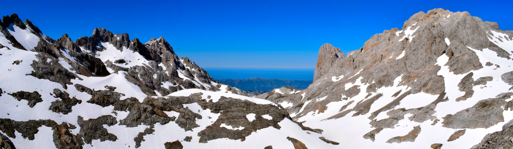

```{r setup, include=FALSE}
knitr::opts_chunk$set(echo = TRUE)
```

```{r message = FALSE, echo = FALSE, warning = FALSE}
load("AlpineOutput.RData")
library(tidyverse); library(kableExtra)
```

```{r, echo = FALSE, fig.align = "center"}

```

# Dataset

````{r echo = FALSE, fig.pos = "H", fig.cap = "Map of the alpine regions with records in the dataset. The size of the circles is proportional to the number of species with records.", fig.align = "center", fig.width = 5, fig.height = 3}
Mapa
```

The current dataset includes seed germination data (germination proportions at given combinations of temperature, temperature alternation, light, stratification, GA3 and scarification) for `r length(unique(TableSpecies$Species))` species from `r length(unique(TableSpecies$Region))` mountain regions and it is based on a selection of the data originally sent by contributors. We standarized the species names provided by the contributors using [The Plant List](http://www.theplantlist.org/). For each species, we recorded the elevation range and the regional treeline elevation from local sources. Based on this information, we removed the species that were not recorded to reach at least the treeline elevation. We also removed the records that had been provided by [ENSCOBASE](http://enscobase.maich.gr/) and [Kew's Millennium Seed Bank database](https://www.kew.org/wakehurst/whats-at-wakehurst/millennium-seed-bank/) because of the impossibility to confirm that they had been collected in an alpine region, and also records from China that came from field instead of laboratory experiments. For the remaining species, we classified them as generalist alpine species (when their minimum elevation reaches below 70% of the regional treeline) or strictly alpine species (when it does not). The actual list of species, with the classification, is provided in a separate Excel file (**please check the classification and recorded treeline elevation for your own region**).

# Sources

Below is a list of sources with the number of species contributed by each. Tudela and Liu are datasets extracted from articles, the rest are original data provided by the contributors.

```{r warning = FALSE, echo = FALSE}
TableSources %>% kable(caption = "List of sources and number of species per source.", booktabs = TRUE) %>% kable_styling(latex_options = c("striped", "hold_position"))
```

# Meta-analysis of the dataset

To meta-analyse the data we followed the recommendations of [Koricheva et al.](https://press.princeton.edu/books/hardcover/9780691137285/handbook-of-meta-analysis-in-ecology-and-evolution) and the [metafor package website](http://www.metafor-project.org/doku.php/todo#extending_rmaglmm_to_multilevel_multivariate_models) for proportion data. To be able to handle random-effect terms (in our case, species and mountain region) we used GLMM. At the moment, the analysis does not take into account species phylogeny because of the complexity of including that into a GLM framework. 

Because of the sparse and unbalanced nature of the dataset, we subsetted the dataset and fitted several relatively simple models (with one fixed effect of interest) to analyse different aspects. For example, to study the effect of temperature we selected a subset of the records that had the same level for the rest of the experimental variables (the most common combination of unstratified seeds, alternating temperatures, light, no GA3 and no scarification).

We present results for germination temperature, temperature alternation and stratification. Ligth (germination in darkness) was only available for 2 species. We repeated the analysis for the full dataset, for the generalists and for the stricly alpine species.

# Germination temperature

```{r warning = FALSE, echo = FALSE}
tableTemperatures %>% kable(caption = "Number of species with germination temperature data included in the GLMM.", booktabs = TRUE) %>% kable_styling(latex_options = c("striped", "hold_position"))
```

````{r echo = FALSE, fig.pos = "H", fig.cap = "Germination proportions at different temperatures. The data are for unstratified seeds with alternating temperatures (the germination temperature is the weighted average of the two phases, rounded up to 5ºC intervals), in light, without GA3 or scarification.", fig.align = "center"}
plotTemperatures
```

# Alternating temperatures

```{r warning = FALSE, echo = FALSE}
tableAlternating %>% kable(caption = "Number of species with alternating temperature data included in the GLMM.", booktabs = TRUE) %>% kable_styling(latex_options = c("striped", "hold_position"))
```

````{r echo = FALSE, fig.pos = "H", fig.cap = "Germination proportions at constant and alternating temperatures. The data are for unstratified seeds with wighted average germination temperatures of 20ºC, in light, without GA3 or scarification.", fig.align = "center"}
plotAlternating
```

# Cold stratification

```{r warning = FALSE, echo = FALSE}
tableStratification %>% kable(caption = "Number of species with cold stratification data included in the GLMM.", booktabs = TRUE) %>% kable_styling(latex_options = c("striped", "hold_position"))
```

````{r echo = FALSE, fig.pos = "H", fig.cap = "Germination proportions in unstratified and cold-stratified seeds. The data are for experiments with alternating temperatures and weighted average germination temperatures of 20ºC, in light, without GA3 or scarification.", fig.align = "center"}
plotStratification
```